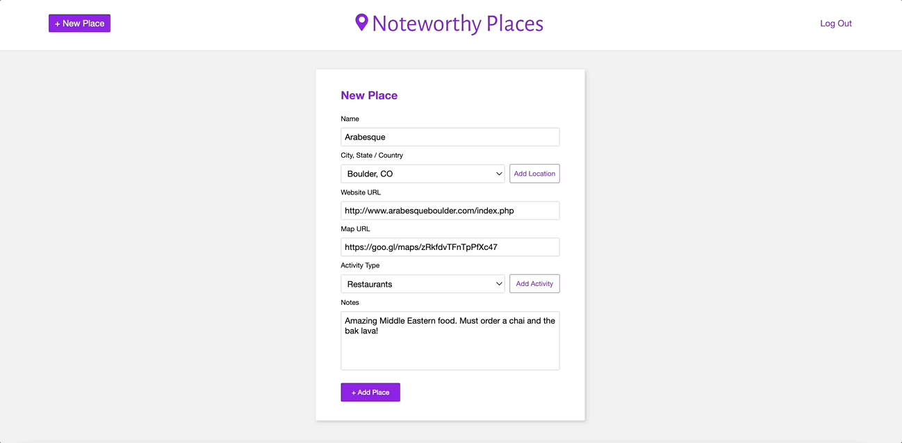

# Noteworthy Places: React / Rails API

## Description

Noteworthy Places allows a user to create an account and add new places of interest in cities they visit. These places of interest can be filtered by activity type or search by city name. When adding a new place of interest, a user also has the option to add new cities and new activity types. Places of interest can be created, edited, and deleted while cities and activities can only be viewed and created.

On login, the user will see a list of their places of interest by city. When clicking 'details' on one place of interest, the user will be able to view more information such as notes, the link to the place of interest website, and gps link (provided valid url's were provided).

## Requirements

To run this application, make sure the following is installed:
- ruby 2.7.4
- node 16.16
- npm version 9.6.2

## How To Use

1. Fork and clone this repository
2. Run `bundle install`
3. Run `rails db:migrate`
4. Run `rails s` to start the backend on [http://localhost:3000](http://localhost:3000)
5. In another terminal, navigate to client directory `cd client`, then run `npm start` to start the frontend on [http://localhost:4000](http://localhost:4000).
